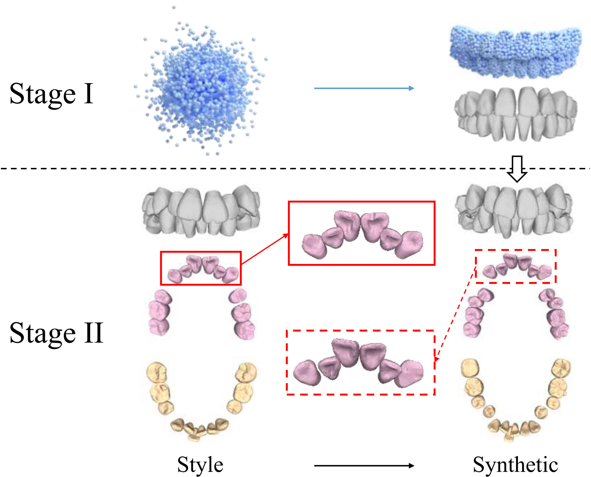

<h2> TeethGenerator: A two-stage framework for paired pre- and post-orthodontic 3D dental data generation

    

We will release the code and dataset of the paper *TeethGenerator: A two-stage framework for paired pre- and post-orthodontic 3D dental data generation* in this repository.

